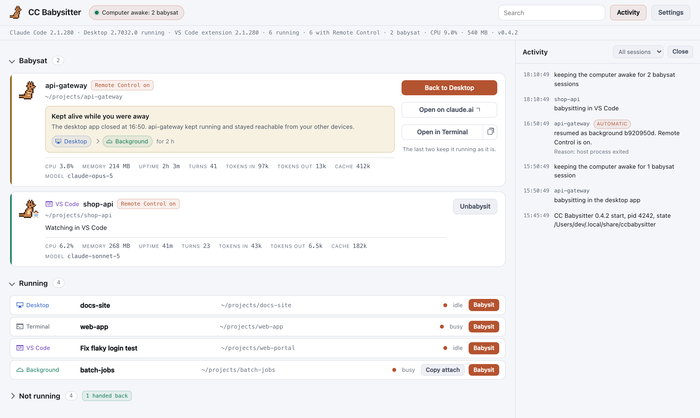

# CC Babysitter

Shows every Claude Code session, and keeps the ones you choose alive, awake and reachable.

CC Babysitter is one local page for every Claude Code session on a machine, whatever app runs it: a terminal, a background session, Claude Desktop or VS Code. Babysit a session and CC Babysitter keeps the computer awake; if the session's app closes while you are away, the session carries on in the background with Remote Control, under the same id, so you can still reach it from your phone. It is one Go binary for macOS, Windows and Linux, the page is served on `127.0.0.1`, and there is nothing to install beside the executable.

<picture>
  <source media="(prefers-color-scheme: dark)" srcset="docs/images/page-dark.png">
  
</picture>

## Why a babysitter?

I left Claude Code working on my laptop overnight, with Remote Control on and "keep computer awake" ticked. Claude Desktop updated itself in the night and never came back, and I couldn't reach the session until morning. I'm not the only one: [1](https://github.com/anthropics/claude-code/issues/92933), [2](https://github.com/anthropics/claude-code/issues/95364), [3](https://github.com/anthropics/claude-code/issues/95491).

On my server I wanted a few sessions running around the clock. That meant tmux, one window per session, and making sure it all came back after every reboot.

CC Babysitter does both. If a babysat session's app dies, the session comes back in the background with Remote Control on, and the computer stays awake. On a server, babysat sessions survive SSH drops and reboots, no tmux needed. And one page shows every Claude Code session on the machine, in any app, with its tokens and uptime. Your agents can use it too: `ccbabysitter babysit self`.

Sure, you could raise it yourself with a watchdog script, tmux and systemd. Some of us prefer a babysitter.

## Install

macOS and Linux:

```
curl -fsSL https://ccbabysitter.dev/install.sh | sh
```

Windows, in PowerShell:

```
irm https://ccbabysitter.dev/install.ps1 | iex
```

Either command downloads the binary of the latest release for your system and processor from the [releases page](https://github.com/pejmanebrahimi/ccbabysitter/releases), checks it against the release's `checksums.txt`, and installs it without admin rights or `sudo`:

- On macOS and Linux it goes to `~/.local/bin/ccbabysitter`. When that folder is not on your PATH, the script prints the line to add to your shell's profile.
- On Windows it goes to `%LOCALAPPDATA%\Programs\CCBabysitter\ccbabysitter.exe`, with `ccbabysitter-background.exe` beside it, the same program built to show no console window, which is what runs in the background. That folder is added to your user Path.

On a Linux machine with no display, such as a server you reach over ssh, the script then runs CC Babysitter once when your systemd user manager is available: it sets itself up as a service and prints how to connect from your laptop. On a Linux desktop, a Mac or a Windows machine where CC Babysitter already runs in the background, the script runs it once too, which restarts it on the new version; on Windows it first asks the running copy to quit, since Windows does not let a running program be replaced. Everywhere else the script prints how to start it. Run the same command again to update. A copy from before version 0.5 running in a window has no quit command: quit it there with Ctrl+C first, and the script says so.

Three environment variables change what the scripts do: `CCBABYSITTER_VERSION` installs a given release, such as `v0.4.0`, instead of the latest, `CCBABYSITTER_INSTALL_DIR` installs into another folder, and `CCBABYSITTER_DOWNLOAD_URL` is a base address to download from instead of GitHub releases, for mirrors (it skips the HTTPS pin, so use an `https://` address). On macOS and Linux:

```
curl -fsSL https://ccbabysitter.dev/install.sh | CCBABYSITTER_VERSION=v0.4.0 sh
curl -fsSL https://ccbabysitter.dev/install.sh | CCBABYSITTER_INSTALL_DIR="$HOME/bin" sh
```

On Windows, in PowerShell, where a variable set this way stays set for the rest of that window:

```
$env:CCBABYSITTER_VERSION='v0.4.0'; irm https://ccbabysitter.dev/install.ps1 | iex
$env:CCBABYSITTER_INSTALL_DIR="$env:USERPROFILE\bin"; irm https://ccbabysitter.dev/install.ps1 | iex
```

You can also download a binary from the releases page yourself (`ccbabysitter-<os>-<arch>`, with `.exe` on Windows, for amd64 and arm64) and check it against `checksums.txt`. On Windows, also download `ccbabysitter-background-windows-<arch>.exe` and save it as `ccbabysitter-background.exe` in the same folder; without it CC Babysitter runs only in the terminal. The binaries are not signed, so a few extra steps apply to a download by hand:

- On macOS and Linux, make it executable: `chmod +x ccbabysitter-<os>-<arch>`.
- On macOS, Gatekeeper blocks a binary downloaded with a browser. Remove the quarantine flag first: `xattr -d com.apple.quarantine ccbabysitter-darwin-<arch>`.
- On Windows, SmartScreen may warn the first time it runs. Choose More info, then Run anyway.

Every release binary carries a build provenance attestation: `gh attestation verify <file> --repo pejmanebrahimi/ccbabysitter --signer-workflow pejmanebrahimi/ccbabysitter/.github/workflows/release.yml` checks it was built from this repository by its release workflow.

Or install it with Go 1.27 or later, which puts it in `$(go env GOPATH)/bin`:

```
go install ccbabysitter.dev/ccbabysitter/cmd/ccbabysitter@latest
```

## Quick start

### Desktop

1. Install with the one-line command for your system, under Install above.
2. Run the command the installer printed, usually `ccbabysitter`. Its page opens in your browser. The page's address includes a key that only your account can read, and `ccbabysitter status` shows that address again. CC Babysitter then runs in the background, starts again when you log in, and gives the terminal back.
3. Switch Remote Control on in the session you want to keep: `/rc` in a terminal, or the switch in Claude Desktop or VS Code. Then press Babysit on its card.
4. Walk away. If the app dies, the session carries on in the background. Reach it from the Claude app on your phone.

### Server

1. Over SSH, run the install command. It sets itself up as a service that starts at boot, and prints how to connect.
2. On your computer, run the `ssh -L ...` command it printed, then open the address it shows. The address includes the page's key, and `ccbabysitter status` on the server shows it again.
3. In a project folder on the server, start a session with `claude --bg --remote-control`. CC Babysitter babysits new sessions as soon as they start.
4. Close SSH. The session survives disconnects and reboots. Reach it from your phone, or with `claude attach <id>`.

## Use it from an AI agent

Your agents can use it too: `ccbabysitter babysit self`. The commands below talk to the CC Babysitter that is running, do what the page does, and work the same for a person or an AI agent. `ccbabysitter --help` lists them, and `ccbabysitter help <command>` explains one.

```
ccbabysitter babysit self          keep the session this runs in alive
ccbabysitter list --json           every session on this machine, as JSON
ccbabysitter babysit api           babysit another session, by name, short id or id
```

A session is named by its id, its short id, its name, or `self`. A full id always wins. A word that fits two sessions, as a short id or a name, is refused. `self` is always the session the command runs in. Add `--json` for one JSON document on stdout. Its top level always has `"schema": 1`, and fields are only ever added. Exit codes: 0 done, 1 refused, 2 wrong usage, 3 CC Babysitter is not running, 4 no such session or more than one. `ccbabysitter help <command>` documents each command's JSON fields. Actions taken this way show in Activity with "from the command line". To try the commands without touching anything real, start `ccbabysitter --demo` and add `--url` with the address it prints.

## Status

Preview. CC Babysitter is early: it has been tested by hand, and there are no automated tests against a real Claude Code install yet; the commands are tested end to end against the built-in demo. Known limits:

- WSL is not supported.
- The binaries are not signed, so Windows SmartScreen and macOS may warn before they run one.
- A babysat session whose app you quit on purpose is currently started again in the background, just as if the app had crashed. Unbabysit it first if you mean to end it.
- On a Linux desktop whose session has no `graphical-session.target`, such as some window managers started by hand, CC Babysitter does not start by itself at login. A plain `ccbabysitter` still starts it in the background.

Behaviour and settings may change before 1.0. Please report problems as [issues](https://github.com/pejmanebrahimi/ccbabysitter/issues). What changed in each version is in `docs/CHANGELOG.md`.

## How it works

A babysat session stays in its own app, and CC Babysitter never moves a session from one app to another. Once a session is carried in the background you have two choices: keep using it through Remote Control, or stop the background copy and open the session again wherever you like.

On a server with no display the same page is the session manager. A plain `ccbabysitter` there sets it up as a service that survives a reboot, prints the command to connect from your laptop, and gives you the terminal back; `ccbabysitter install` does the same. Start a session yourself with `claude --bg --remote-control` in a project folder and it is babysat as soon as it starts, unless you switch that off in Settings. Attach to a babysat session from any SSH shell, unbabysit or stop it when you are done, and reach the page with the command CC Babysitter gave you.

## What babysitting does

- Keeps the computer awake while at least one babysat session is running or being started.
- Tells you how to switch Remote Control on when it is off. Nothing outside a session can switch it on.
- If the session's app closes, starts the session again as a background session with Remote Control, under the same id, with `claude --bg --resume`.
- Lets you unbabysit while the session is still in its own app. Once the background copy carries it, you stop the copy instead with `claude stop`, which keeps the conversation.
- Says before you babysit when a background copy could not start: the Claude Code CLI must trust the folder, so run `claude` there once, and it never starts in your home folder.
- Offers, in the same dialog, to start CC Babysitter at login so the promise survives a restart, when that is off. On Linux a plain `ccbabysitter` turns it on the first time it runs.
- Stops babysitting a session that ended before anything was said in it, and says so in Activity: Claude saves a conversation only after the first message, so there is nothing to bring back.
- Waits 90 seconds after it starts on a machine with a display before starting anything in the background, so apps that restore their own sessions at login, Claude Desktop in particular, go first.
- Gives every background session a Copy button for `claude attach <short>`, and on a server a second one for the same command run over `ssh` from another machine. A background copy stopped from the page keeps both on its Not running row, until CC Babysitter restarts.

## Hard rules

- **Opt-in only.** Nothing happens to a session that is not babysat. On a desktop, babysitting is always something you choose. On a server, a new background session is babysat as soon as it starts, unless "Babysit every new background session" is switched off in Settings.
- **Every automatic action is explained** in the Activity panel with its reason.
- **Stopping a background copy is confirmed first**, and nothing else the page does closes a session.
- **Claude's files are read-only.** Sessions are controlled only through the `claude` CLI.
- **Claude Desktop and VS Code are never modified or opened.**
- **Loopback only.** The page is served on `127.0.0.1`, requests that come from other web pages are refused, and every request must carry the page's key, which only your account can read.
- **User mode only.** No admin rights, ever. The only thing CC Babysitter adds to your system is its own start-at-login entry in your user account: a systemd user unit on Linux, a LaunchAgent on macOS, a Run value on Windows. It is on by default, and you can turn it off with `ccbabysitter settings autostart off`, or on a desktop in Settings.
- **One folder of state** (`%LOCALAPPDATA%\CCBabysitter` on Windows, the XDG data directory elsewhere: `~/.local/share/ccbabysitter`, or `$XDG_DATA_HOME/ccbabysitter` when that is set).

## Usage

```
ccbabysitter                 start CC Babysitter. It runs in the background and starts at login
ccbabysitter --foreground    run in this terminal until Ctrl+C
ccbabysitter --no-open       start it without opening the page
ccbabysitter --demo          scripted sessions, touches nothing real
ccbabysitter --port N        with --foreground, prefer this port for the page, 47391 by default, else a random free port
ccbabysitter install         on Linux, set it up to start at boot and keep running after logout
ccbabysitter uninstall       reverse install
ccbabysitter reset           delete the state folder after confirmation
ccbabysitter version         print the name and version

ccbabysitter status          is it running, where, and what it is doing
ccbabysitter list            every Claude Code session on this machine
ccbabysitter show S          one session in full
ccbabysitter babysit S       keep S alive: if its app dies, it comes back in the background
ccbabysitter unbabysit S     stop babysitting S, which keeps running where it is
ccbabysitter retry S         try again on a babysat session that is stuck
ccbabysitter stop S --yes    stop the background copy of S and keep the conversation
ccbabysitter activity [S]    what CC Babysitter did and why, newest first
ccbabysitter settings        show the settings, or change one with: settings NAME VALUE
ccbabysitter quit            quit CC Babysitter. Babysat sessions keep running where they are
ccbabysitter help COMMAND    everything about one command
```

On a Linux server, `ccbabysitter` prints the command to connect from your laptop, such as `ssh -L 47391:127.0.0.1:47391 user@host`, then open the address it prints, `http://127.0.0.1:47391/?token=...` with the page's key, while that connection is open. The same window stays an ordinary shell on the server. On a cloud server behind NAT, the printed address can be the server's private one; use the address you normally ssh to instead. To run CC Babysitter only while a terminal stays open instead, use `ccbabysitter --foreground`.

## Start at login

On Linux, `ccbabysitter` runs CC Babysitter in the background through the systemd user manager, writing the unit `~/.config/systemd/user/ccbabysitter.service` the first time, and turns start at login on that first time, also when you upgrade from an earlier version. On a desktop the unit starts with your graphical session, after it, so CC Babysitter sees the desktop. On a server it starts at boot and keeps running after you log out. Turn it off with `ccbabysitter settings autostart off`, or on a desktop in Settings: CC Babysitter keeps running until you quit it or restart, and a later `ccbabysitter` leaves it off. Every run, and `ccbabysitter install`, writes the unit again when it no longer matches this binary, such as after you move the binary, and restarts a running copy when its unit changed or it is another version. A copy already running with the right unit and version is left running. `ccbabysitter install` always turns start at boot on.

On macOS, `ccbabysitter` runs CC Babysitter in the background as a user LaunchAgent, `com.ccbabysitter`, loaded with `launchctl` the way `brew services start` does it, and turns start at login on that first time, also when you upgrade. The LaunchAgent runs the service, which never opens a browser, so logging in does not open the page; it starts CC Babysitter again if it crashes, but not after `ccbabysitter quit`. While start at login is on its plist is `~/Library/LaunchAgents/com.ccbabysitter.plist`. macOS may show a "Background Items Added" notice the first time, and lists CC Babysitter under System Settings, General, Login Items. Switching it off there under Allow in the Background stops macOS from starting it at all, and `ccbabysitter` then says so; switch it back on there, or run `ccbabysitter --foreground`. Turning start at login off moves the plist into the state folder: CC Babysitter keeps running until you quit it or log out, and a plain `ccbabysitter` still starts it. A Mac reached only over ssh, with nobody logged in at its screen, has no session to load the LaunchAgent into, so there `ccbabysitter` runs in the terminal.

On Windows, `ccbabysitter` starts `ccbabysitter-background.exe`, the windowless copy installed beside it, which runs in the background with no console window; closing the terminal or the app that ran `ccbabysitter` does not stop it. Start at login, turned on the first time, is the value `CCBabysitter` under `HKCU\Software\Microsoft\Windows\CurrentVersion\Run`, which starts the windowless copy at login, again with no window. It replaces the Startup folder script `CCBabysitter.cmd` that earlier versions wrote, which `ccbabysitter` removes. A copy installed with `go install` has no windowless program, so there `ccbabysitter` runs in the terminal.

Every login entry points at the program where it is at that moment, so keep the program where the install script put it, or somewhere else it will stay, such as `~/bin`; a copy in a temporary folder is refused. `ccbabysitter` writes the unit, the LaunchAgent or the Run value again when the program has moved.

## Uninstall

`ccbabysitter reset` deletes the state folder after asking, and refuses while CC Babysitter is still running, so quit it first. Run the steps for your system in this order.

macOS:

1. Run `ccbabysitter uninstall`. It stops the LaunchAgent and removes its plist, `~/Library/LaunchAgents/com.ccbabysitter.plist` or the one in the state folder.
2. Quit any copy still running in a terminal with `ccbabysitter quit` or Ctrl+C.
3. Run `ccbabysitter reset` to delete the state folder, `~/.local/share/ccbabysitter` (or `$XDG_DATA_HOME/ccbabysitter`).
4. Delete the binary: `rm ~/.local/bin/ccbabysitter`, or wherever `command -v ccbabysitter` says it is.

Linux:

1. Run `ccbabysitter uninstall`. It stops and disables the systemd user service and removes `~/.config/systemd/user/ccbabysitter.service`, however the unit was written: by a plain `ccbabysitter`, by `ccbabysitter install`, or by "Start CC Babysitter when I log in". It turns lingering off for your user only when CC Babysitter turned it on, which it notes in the file `lingering-turned-on` in the state folder; lingering that was already on is left on, since other services of yours may need it. Skip this step if none of those happened.
2. Quit any copy still running in a terminal with `ccbabysitter quit` or Ctrl+C.
3. Run `ccbabysitter reset` to delete the state folder, `~/.local/share/ccbabysitter` (or `$XDG_DATA_HOME/ccbabysitter`).
4. Delete the binary: `rm ~/.local/bin/ccbabysitter`, or wherever `command -v ccbabysitter` says it is.

Windows:

1. Run `ccbabysitter uninstall`. It quits CC Babysitter and removes its Run value, and an earlier version's `CCBabysitter.cmd` from your Startup folder.
2. Quit any copy still running in a window with `ccbabysitter quit` or Ctrl+C.
3. Run `ccbabysitter reset` to delete the state folder, `%LOCALAPPDATA%\CCBabysitter`.
4. Delete the folder holding the binary, `%LOCALAPPDATA%\Programs\CCBabysitter`, or the folder you installed into.
5. Remove that folder from your user Path: open "Edit environment variables for your account" from the Start menu, select Path, choose Edit, and delete the entry.

A copy installed with `go install` is deleted from `$(go env GOPATH)/bin` instead.

## Requirements

The `claude` CLI at run time, on PATH or where its installer puts it (`~/.local/bin` or `~/.claude/local`): CC Babysitter reads Claude Code's own files and drives sessions through the CLI. It needs Claude Code 2.1.275 or later. With an older CLI it still runs, but prints a warning when it starts, since older versions may word their output differently and some things may not work as described. Building needs only Go 1.27 or later.

## Build from source

```
git clone https://github.com/pejmanebrahimi/ccbabysitter
cd ccbabysitter
go test ./...
go build -o bin/ccbabysitter ./cmd/ccbabysitter
```

See `CONTRIBUTING.md` to send a change, and `SECURITY.md` to report a vulnerability.

## License

MIT. See `LICENSE`.
